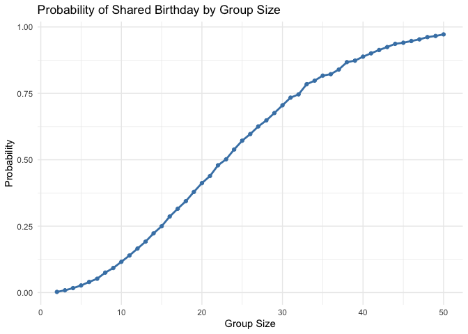
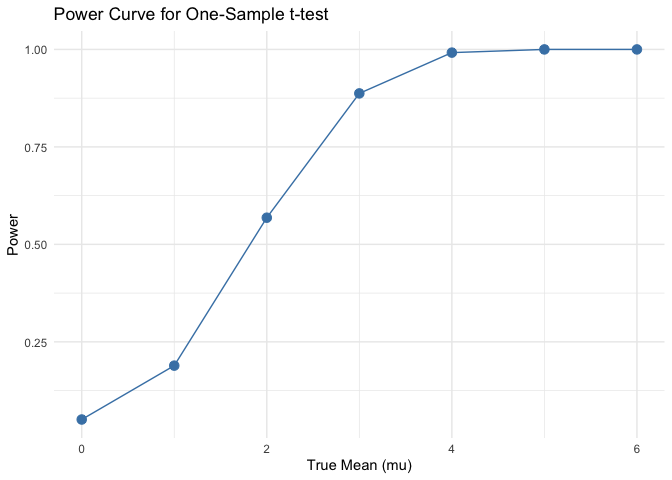
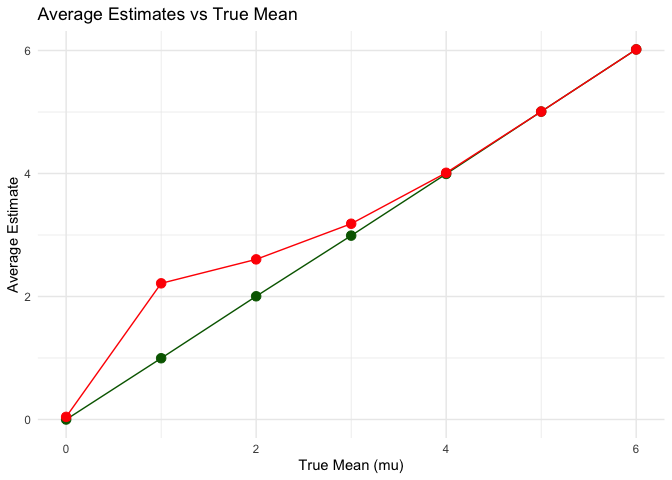
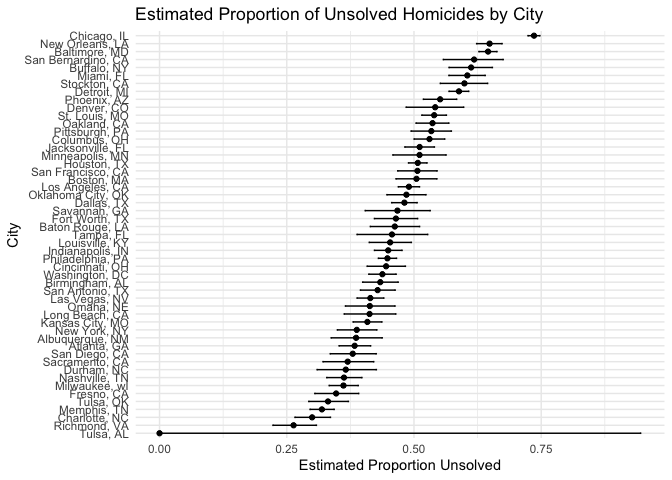

p8105 Homework 5
================
Bing Li (bl3175)

``` r
# load only the packages needed for HW5
library(tidyverse)
library(modelr)
library(broom)

set.seed(1)
```

## Problem 1

### Birthday simulation function + plot

``` r
# Function: for a given group size, check if at least two people share a birthday
birthday_shared = function(n) {
  bdays = sample(1:365, size = n, replace = TRUE)  # random birthdays
  any(duplicated(bdays))  # TRUE if duplicates exist
}

# run simulation for group sizes 2–50, each repeated 10000 times
sim_results =
  tibble(group_size = 2:50) |> 
  mutate(
    shared_prob = map_dbl(
      group_size,
      \(g) mean(replicate(10000, birthday_shared(g)))
    )
  )

# plot probability vs group size
sim_results |> 
  ggplot(aes(x = group_size, y = shared_prob)) +
  geom_line(color = "steelblue", linewidth = 1) +
  geom_point(color = "steelblue") +
  labs(
    title = "Probability of Shared Birthday by Group Size",
    x = "Group Size",
    y = "Probability"
  ) +
  theme_minimal()
```

<!-- -->

### Comment

The probability of sharing a birthday increases rapidly with group
size.  
It reaches about 50% around n ≈ 23 (classic birthday paradox),  
and approaches 1 by the time the group size reaches 50.

``` r
# Load needed packages
library(tidyverse)
library(broom)

# Problem 2: Power simulation for one-sample t-test

# This function runs one dataset for a given true mean
run_one_sim <- function(mu) {
  # Generate sample of size n = 30 with sd = 5
  x <- rnorm(30, mean = mu, sd = 5)
  
  # Perform one-sample t-test and tidy output
  test_result <- t.test(x, mu = 0) |> tidy()
  
  # Save estimate and p-value
  tibble(
    estimate = test_result$estimate,
    p_value = test_result$p.value
  )
}

# True means to investigate
mu_values <- 0:6

# Run 5000 simulations for each mu
set.seed(1)
sim_results <- 
  expand_grid(
    mu = mu_values,
    iter = 1:5000
  ) |>
  mutate(result = map(mu, run_one_sim)) |>
  unnest(result)

# 1. Compute power for each true mean
power_df <- 
  sim_results |>
  group_by(mu) |>
  summarize(power = mean(p_value < 0.05))

# Plot power curve
power_df |>
  ggplot(aes(x = mu, y = power)) +
  geom_point(size = 3, color = "steelblue") +
  geom_line(color = "steelblue") +
  labs(
    title = "Power Curve for One-Sample t-test",
    x = "True Mean (mu)",
    y = "Power"
  ) +
  theme_minimal()
```

<!-- -->

``` r
# 2. Compute average estimate for all samples and for only rejected samples
estimate_df <- 
  sim_results |>
  group_by(mu) |>
  summarize(
    mean_estimate = mean(estimate),
    mean_estimate_rejected = mean(estimate[p_value < 0.05])
  )

# Plot both estimates
estimate_df |>
  ggplot(aes(x = mu)) +
  geom_point(aes(y = mean_estimate), color = "darkgreen", size = 3) +
  geom_line(aes(y = mean_estimate), color = "darkgreen") +
  geom_point(aes(y = mean_estimate_rejected), color = "red", size = 3) +
  geom_line(aes(y = mean_estimate_rejected), color = "red") +
  labs(
    title = "Average Estimates vs True Mean",
    x = "True Mean (mu)",
    y = "Average Estimate"
  ) +
  theme_minimal()
```

<!-- -->

### Comment

#### Effect Size and Power

As the true mean increases, the power rises quickly. This makes sense
because larger effect sizes make it easier for the t-test to detect a
difference from 0. Power is very low near μ = 0, but it increases
steadily and approaches 1 once the effect is large enough. Overall, the
relationship is smooth and consistent with what we expect from theory.

#### Average Estimates

For all samples, the average estimate is roughly equal to the true mean,
which is what we expect. However, the average estimate among only
rejected samples is noticeably higher than the truth when μ is small.
This shows the selection bias caused by looking only at significant
results. When the effect is larger, this bias becomes smaller.

## Problem 3

``` r
# Read the homicide dataset
homicide_df <- read_csv("data/homicide-data.csv")

# Clean and inspect raw data -------------------------------------------

# Create "city_state" field and count solved / unsolved
city_summary <- 
  homicide_df |>
  mutate(
    city_state = str_c(city, ", ", state),
    unsolved = disposition %in% c("Closed without arrest", "Open/No arrest")
  ) |>
  group_by(city_state) |>
  summarize(
    total = n(),
    unsolved_total = sum(unsolved)
  )

# Baltimore only --------------------------------------------------------

baltimore_result <- 
  homicide_df |>
  filter(city == "Baltimore", state == "MD") |>
  mutate(
    unsolved = disposition %in% c("Closed without arrest", "Open/No arrest")
  ) |>
  summarize(
    total = n(),
    unsolved_total = sum(unsolved)
  )

# Run prop.test for Baltimore
baltimore_test <- prop.test(
  x = baltimore_result$unsolved_total,
  n = baltimore_result$total
)

# Tidy Baltimore output
baltimore_tidy <- broom::tidy(baltimore_test)

# Pull estimated proportion and CI
baltimore_estimate <- baltimore_tidy$estimate
baltimore_ci_low  <- baltimore_tidy$conf.low
baltimore_ci_high <- baltimore_tidy$conf.high

# prop.test for ALL cities ---------------------------------------------

city_prop_df <- 
  homicide_df |>
  mutate(
    city_state = str_c(city, ", ", state),
    unsolved = disposition %in% c("Closed without arrest", "Open/No arrest")
  ) |>
  group_by(city_state) |>
  summarize(
    total = n(),
    unsolved_total = sum(unsolved)
  ) |>
  mutate(
    test_result = map2(
      unsolved_total, total,
      \(x, n) prop.test(x = x, n = n)
    ),
    tidy_result = map(test_result, broom::tidy)
  ) |>
  unnest(tidy_result) |>
  select(
    city_state,
    estimate,
    conf.low,
    conf.high
  )

# Plot: estimates & CI --------------------------------------------------

ggplot(city_prop_df, aes(
  x = reorder(city_state, estimate),
  y = estimate
)) +
  geom_point() +
  geom_errorbar(aes(
    ymin = conf.low,
    ymax = conf.high
  ), width = 0.2) +
  coord_flip() +
  labs(
    title = "Estimated Proportion of Unsolved Homicides by City",
    x = "City",
    y = "Estimated Proportion Unsolved"
  ) +
  theme_minimal()
```

<!-- -->

### Comment

The raw dataset contains more than 50,000 homicide cases from major U.S.
cities. For each case, we have information about the victim, location,
and how the case was handled. A key variable in this analysis is whether
the case was solved or remained unsolved. I combined the city and state
into one variable to summarize the proportion of unsolved cases in each
city.
